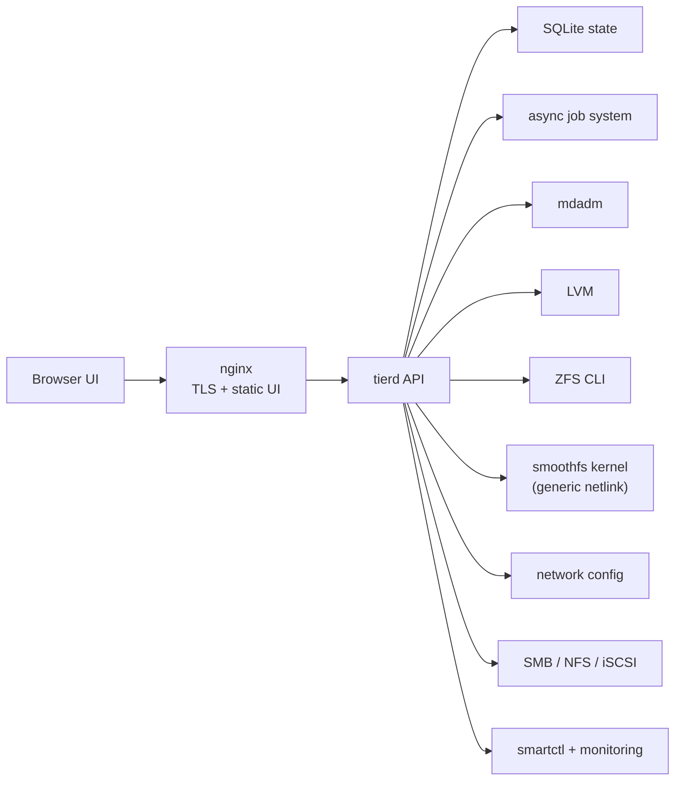
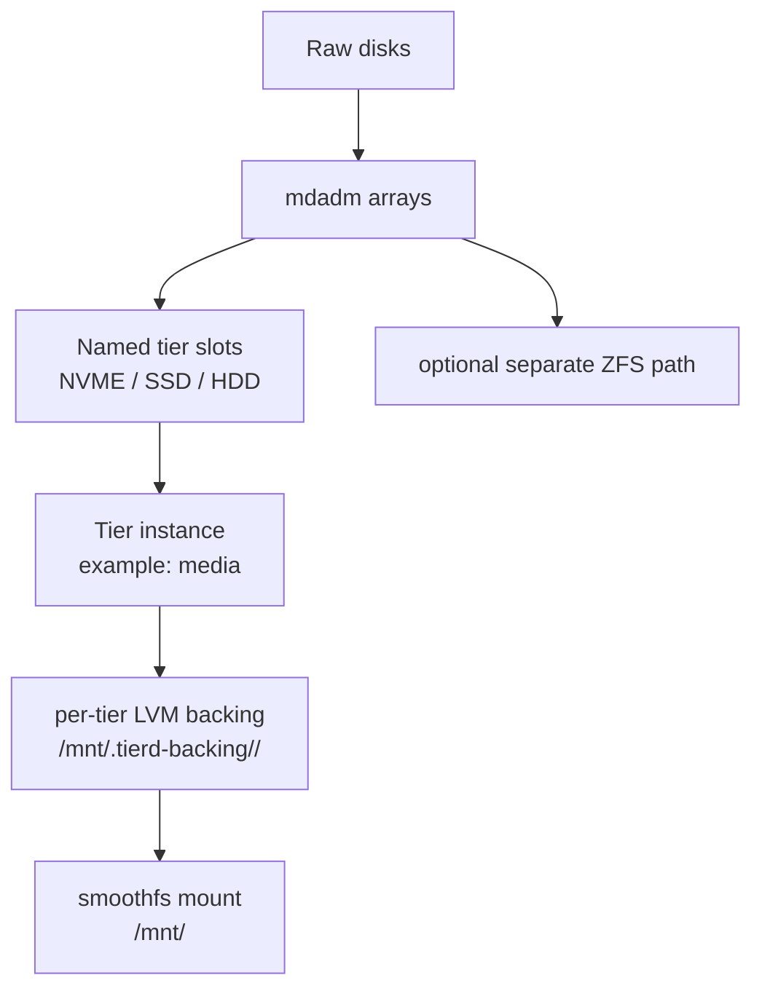
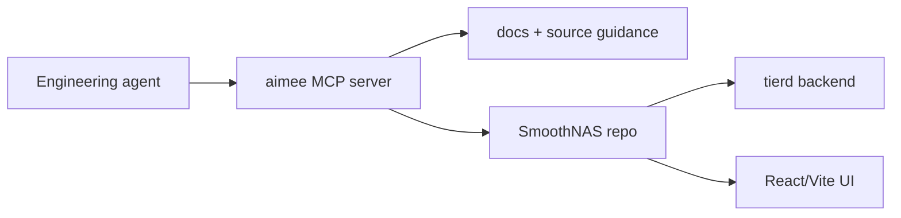

# SmoothNAS

SmoothNAS is a Linux storage appliance for people who want the power of the Linux storage stack without having to stitch it together by hand.

It combines:

- `mdadm` for RAID
- `LVM` for named tier backing
- `ZFS` for pool-based storage
- `smoothfs` — the in-tree stacked kernel filesystem that presents tiered storage as a single mount and drives file placement across tiers
- `SMART`, benchmarking, networking, and sharing controls
- a custom Debian installer and a web UI that drives the whole system
- repo-local `aimee` MCP support for engineering agents

The result is an appliance you can install on commodity hardware, manage from a browser, and keep evolving without abandoning the Linux tools underneath it.

## Why SmoothNAS

Most Linux storage stacks force you to choose between:

- raw flexibility with a lot of shell work
- or a polished appliance that hides the underlying system too aggressively

SmoothNAS takes a different route:

- it uses familiar Linux primitives instead of a proprietary storage engine
- it exposes storage workflows in a UI that matches how operators actually think
- it supports more than one storage model instead of forcing every workload into the same abstraction
- it keeps the system inspectable and recoverable with standard tools

If you know Linux and you want an appliance that still feels like Linux, this is the point of the project.

## What You Can Do

- Build mdadm arrays from raw disks and manage them asynchronously through the UI.
- Create named storage tiers with slot-based array assignment for `NVME`, `SSD`, and `HDD`.
- Run ZFS pools, datasets, zvols, and snapshots alongside the mdadm/LVM path.
- Publish storage over SMB, NFS, and iSCSI.
- Benchmark local and remote targets with live fio-driven telemetry.
- Monitor disk health and system alerts.
- Install updates from GitHub releases or local release artifacts.

## Who It Is For

SmoothNAS is a good fit if you are building:

- a homelab NAS that should stay understandable under failure
- a workstation-side storage appliance with NVMe, SSD, and HDD classes
- a small office file server that needs browser-driven management
- a project that values transparent Linux plumbing over magic

It is not trying to be a distributed storage system, a cloud control plane, or a turnkey enterprise SAN.

## Storage Models

SmoothNAS intentionally supports multiple storage paths because different workloads want different tradeoffs.

| Model | Best For | Managed By |
| --- | --- | --- |
| `mdadm` arrays | simple RAID-backed storage | Arrays page + backend jobs |
| named tiers | explicit fast/warm/cold storage design | Tiers page |
| `smoothfs` pools | tiered storage presented as a single mount, with in-kernel heat-driven placement | Tiers page (per-tier backings) + smoothfs service |
| `ZFS` | pool-based storage, datasets, snapshots | Pools and ZFS pages |

The data-plane filesystem for tiered pools is `smoothfs`, a stacked kernel
module (sources under `src/smoothfs/`). tierd is the control plane: it
provisions per-tier backings with `mdadm`/`LVM`/`ZFS`, writes a systemd
mount unit that mounts `-t smoothfs` over those lower tiers, and then
drives planning, movement, and heat tracking through generic-netlink
with the kernel module. There is no user-space filesystem daemon.

## User Guide

### 1. Install the appliance

SmoothNAS ships with a custom Debian-based installer. The installer:

- boots into a guided environment
- lets you select separate OS disks
- optionally mirrors the OS with RAID-1
- leaves non-OS disks free for managed storage
- installs the backend, frontend, nginx, and system services together

For the install-time mechanics and service layout, see [docs/OPERATIONS.md](docs/OPERATIONS.md).

### 2. First login

Once the system is up:

1. open the web UI
2. review detected disks and SMART state
3. create your first RAID array
4. decide whether that array should stay standalone or join a named tier

### 3. Choose your storage pattern

You can take one of two common paths:

1. `Array -> share it`
2. `Array -> assign it to a named tier`

For ZFS users, the ZFS pages remain a separate first-class path.

### 4. Build a named tier

A named tier instance gives you a mountable storage target such as `/mnt/media`, backed by one or more mdadm arrays assigned into `NVME`, `SSD`, and `HDD` slots.

Typical workflow:

1. create the mdadm arrays that represent your physical storage classes
2. create a tier instance, such as `media`
3. assign one array per slot as needed
4. let SmoothNAS provision the LVM backing and mountpoint

### 5. Share the storage

Once you have storage online, publish it through:

- SMB for general file serving
- NFS for Unix/Linux clients
- iSCSI for block-oriented consumers

### 6. Tune and observe

Day-2 operations are part of the product, not an afterthought:

- benchmark arrays, paths, and remote shares
- inspect SMART history and alarms
- watch alerts and hardware state
- adjust update channels and apply new releases

## Architecture At A Glance







## Current Status

SmoothNAS is already usable and the active storage model is now the named-tier-instance system with slot-based assignment.

## Documentation Map

- [src/README.md](src/README.md) for the technical deep dive
- [docs/ARCHITECTURE.md](docs/ARCHITECTURE.md) for subsystem and data-flow diagrams
- [docs/OPERATIONS.md](docs/OPERATIONS.md) for build, install, release, and operational notes
- [docs/AIMEE.md](docs/AIMEE.md) for agents consuming the repo-local `aimee` MCP server
- [`RakuenSoftware/smoothfs`](https://github.com/RakuenSoftware/smoothfs) for the extracted smoothfs filesystem project consumed by SmoothNAS
- [docs/proposals](docs/proposals) for the design history behind the storage model

## Development Snapshot

Backend:

```bash
export GIT_CONFIG_COUNT=1
export GIT_CONFIG_KEY_0=url.git@github.com:.insteadOf
export GIT_CONFIG_VALUE_0=https://github.com/
export GOPRIVATE=github.com/RakuenSoftware/*
export GONOSUMDB=github.com/RakuenSoftware/*
cd tierd
CGO_ENABLED=1 go test ./...
```

Frontend:

```bash
cd tierd-ui
npm install
npm run build
npm test
```

Full project build:

```bash
make build
```

## Project Pitch, In One Sentence

SmoothNAS is for operators who want a storage appliance that feels polished from the browser and honest from the shell.
