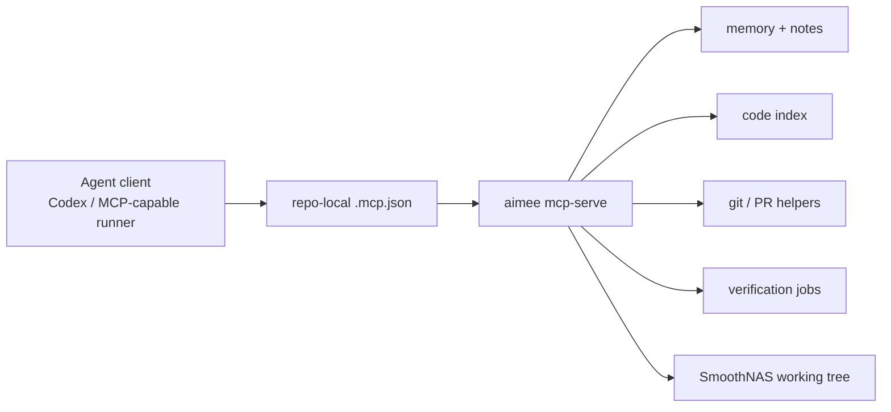
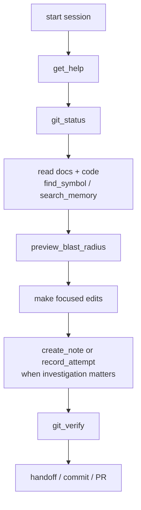

# Aimee Consumer Guide

This page is for agents and agent-platform maintainers that need to consume the local `aimee` MCP server while working in the SmoothNAS repository.

It complements:

- [../README.md](../README.md) for the product-level view
- [ARCHITECTURE.md](ARCHITECTURE.md) for runtime and subsystem diagrams
- [../src/README.md](../src/README.md) for code-level orientation
- [OPERATIONS.md](OPERATIONS.md) for build, test, and release workflow

## 1. What `aimee` Is Doing Here

SmoothNAS exposes an `aimee` MCP server through [../.mcp.json](../.mcp.json).

That server is not part of the appliance runtime seen by end users. It is an engineering surface for agents that need:

- repository memory and prior decisions
- indexed symbol lookup
- blast-radius analysis before edits
- delegated background work
- Git and PR workflow helpers
- project verification and readiness checks

## 2. Connection Model

The repository-local MCP wiring is:

```json
{
  "mcpServers": {
    "aimee": {
      "command": "/usr/local/bin/aimee",
      "args": ["mcp-serve"]
    }
  }
}
```

Any agent client that honors repo-local MCP configuration can consume `aimee` from that file directly.



## 3. Required First Step

At session start, call `get_help`.

That is the contract `aimee` expects, and it gives the compact topic index needed to discover the current tooling surface before doing work.

Typical startup sequence:

1. connect to the MCP server from [../.mcp.json](../.mcp.json)
2. call `get_help`
3. inspect `git_status`
4. use `find_symbol`, `search_memory`, or repo reads to build context
5. run `preview_blast_radius` before broader edits
6. use `git_verify` before handoff or PR preparation

## 4. Core MCP Surface

The highest-value tools for this repo are:

| Tool | Use in SmoothNAS work |
| --- | --- |
| `get_help` | bootstrap the session and inspect topic docs |
| `search_memory` / `list_facts` | recover prior decisions and durable repo facts |
| `find_symbol` | jump to backend/frontend symbols without broad grep passes |
| `preview_blast_radius` | estimate file impact before larger edits |
| `delegate` | offload bounded coding, review, or validation tasks |
| `create_note` / `search_notes` | preserve investigation context |
| `git_status`, `git_diff_summary`, `git_log` | inspect local Git state through MCP |
| `git_verify` | run project verification, environment checks, or PR readiness |
| `git_pr` | inspect or prepare PR state from the same tool surface |

## 5. Recommended Agent Workflow

Use `aimee` as an accelerator, not as a replacement for reading the repo.



Practical guidance for SmoothNAS:

- Read the top-level docs first. Storage behavior is spread across backend, frontend, installer, and proposal history.
- Treat [../src/README.md](../src/README.md) as the code-entry map before diving into package internals.
- For backend routing, start at [../tierd/internal/api/router.go](../tierd/internal/api/router.go).
- For named-tier persistence, start at [../tierd/internal/db/tier_instances.go](../tierd/internal/db/tier_instances.go).
- For the active frontend entrypoint, start at [../tierd-ui/src/main.tsx](../tierd-ui/src/main.tsx) and [../tierd-ui/src/App.tsx](../tierd-ui/src/App.tsx).

## 6. Repo-Specific Truths Agents Should Know

Agents consuming `aimee` in this repo should not assume the docs reflect an older SmoothNAS shape.

Current realities:

- the backend runtime is `nginx -> tierd -> SQLite + Linux tooling`
- the public storage story is named tier instances plus standalone ZFS
- the active frontend entrypoint is React + Vite
- the canonical public repo is `RakuenSoftware/smoothnas`
- the Go module path and `jbailes` updater channel still carry migration debt from `JBailes/SmoothNAS`

That means agent work should verify assumptions against the tree instead of trusting older prose or proposal sections blindly.

## 7. Delegation

`aimee` supports delegation for bounded side work such as:

- implementing a small isolated patch
- reviewing a specific diff or failure
- collecting evidence for a subsystem question
- validating a build or test path

Common roles include:

- `code`
- `review`
- `explain`
- `refactor`
- `draft`
- `summarize`
- `deploy`
- `validate`
- `test`
- `diagnose`
- `execute`

Use delegation when the task is concrete and independently scoped. Do not hand off the immediate blocking step if the main agent can complete it directly with less coordination cost.

## 8. Verification

`git_verify` is the preferred verification entrypoint when the project is configured for it.

It supports:

- full verification runs
- async background verification with a returned job ID
- environment checks
- semantic conflict inspection
- PR readiness checks

If `.aimee/project.yaml` exists and defines verification steps, agents should prefer that surface over inventing ad hoc verification flows.

## 9. Documentation Reading Order For Agents

For a new agent entering the repo:

1. [../README.md](../README.md)
2. [ARCHITECTURE.md](ARCHITECTURE.md)
3. [../src/README.md](../src/README.md)
4. [OPERATIONS.md](OPERATIONS.md)
5. [../tierd/internal/api/router.go](../tierd/internal/api/router.go)
6. [../tierd-ui/src/App.tsx](../tierd-ui/src/App.tsx)

That order gets an agent from system shape to operational workflow to concrete code entrypoints with minimal false assumptions.
