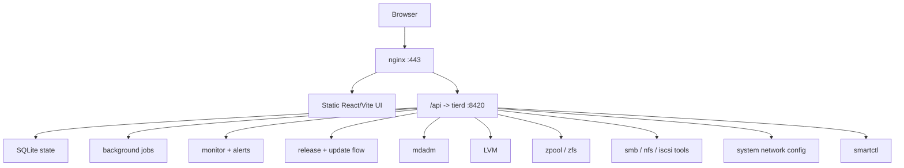
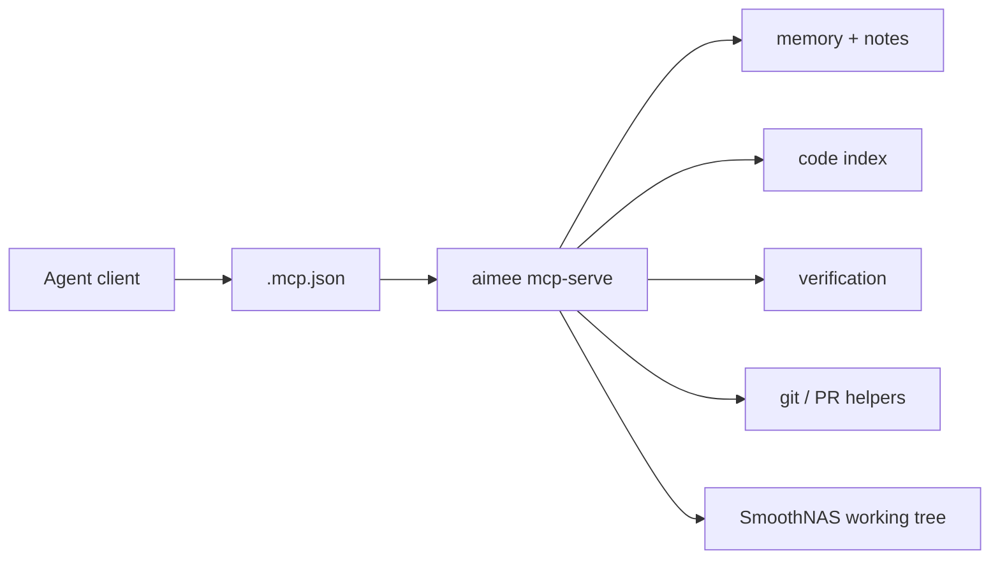
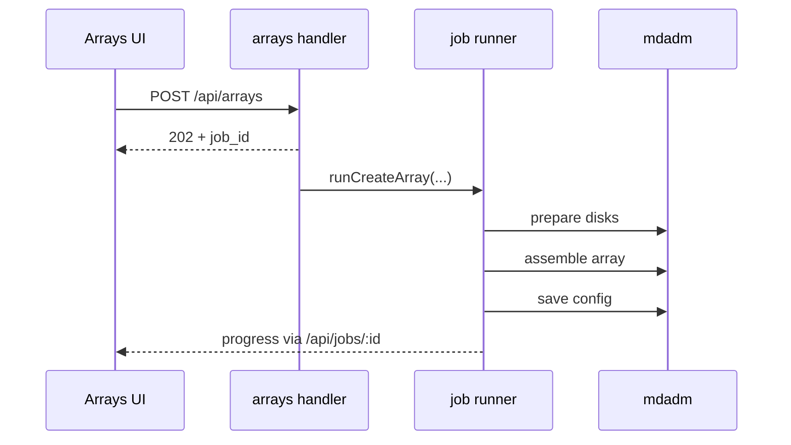
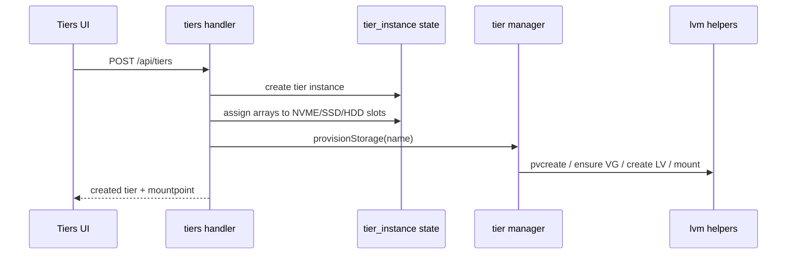
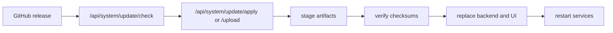

# SmoothNAS Architecture

This page is the system-level architecture companion to the source deep dive in [../src/README.md](../src/README.md).

## 1. Runtime Topology

## 1.1 Engineering Topology

The repository also exposes a repo-local `aimee` MCP server for engineering agents. That surface is separate from the appliance runtime.

## 2. Major Architectural Decisions

### Linux primitives first

SmoothNAS does not try to replace Linux storage tooling. It orchestrates:

- `mdadm`
- `LVM`
- `ZFS`
- `smartctl`
- system networking and service configuration

That makes the system more inspectable and easier to recover manually.

### API-driven orchestration

The UI does not talk to shell scripts directly. It talks to a structured backend that:

- validates input
- stores durable state in SQLite
- runs slow or destructive operations as jobs
- emits progress and errors back to the browser

### Multiple storage paths instead of one forced abstraction

SmoothNAS supports:

- mdadm arrays
- named tiers
- ZFS

These are treated as parallel capabilities, not as temporary compatibility hacks.

## 3. Storage Control Flow

### Array creation

### Named tier provisioning

### Update pipeline

## 4. Data Model

The important persistent state buckets are:

| Domain | Examples |
| --- | --- |
| auth | sessions, users |
| storage | tier instances, array-slot assignments |
| operations | migration regions and states |
| observability | SMART history, alarms |
| sharing | SMB/NFS/iSCSI definitions |

The schema is managed through [`tierd/internal/db/migrations.go`](../tierd/internal/db/migrations.go).

## 5. Frontend Architecture

The frontend is now a route-based React application built with Vite.

It follows a simple model:

- fetch data through services
- start work through API calls
- poll jobs when work is asynchronous
- show raw operational state rather than hiding it behind marketing abstractions

That is important to the project identity: the UI is supposed to make Linux storage understandable, not pretend it is something else.

For agent setup and MCP workflow, see [AIMEE.md](AIMEE.md).

## 6. Current Transitional Areas

Two architecture cleanups are still pending and should stay visible:

### Tier model convergence

The public API and UI are already centered on named tier instances, but parts of the lower-level tier implementation still reflect the older fixed-tier phase.

This needs to be unified so:

- comments match reality
- helper structures are not duplicated
- one canonical storage story exists from UI to orchestration

### Repository-owner convergence

The project now lives at `RakuenSoftware/smoothnas`, and the public updater channels already follow that repo. The remaining repo-identity debt is:

- the Go module path still references `JBailes/SmoothNAS`
- the private `jbailes` updater channel still clones `JBailes/SmoothNAS` over SSH and builds from source

This still needs to be updated so:

- the Go module identity matches the actual repository
- the private update path can consume authenticated release artifacts instead of compiling on the target system
- the deployment and release story are consistent

## 7. Design History

The design history is intentionally preserved in [../docs/proposals](../docs/proposals). That material is useful, but it should be read as historical context, not as a guarantee that every proposal section matches the exact shipping model today.
