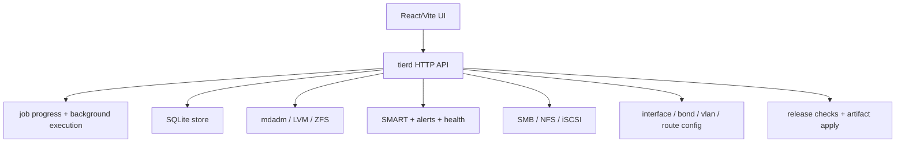
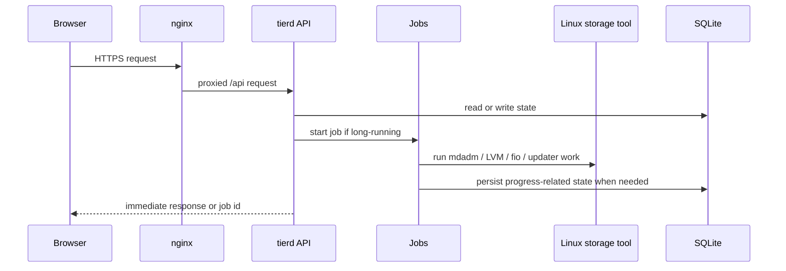
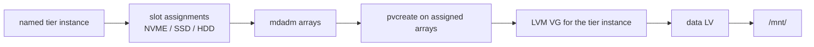

# SmoothNAS Source Deep Dive

This document explains how SmoothNAS is actually built.

The root [README.md](../README.md) is for users deciding whether the project is worth running. This file is for engineers trying to understand:

- how requests move through the system
- where state lives
- how storage orchestration is layered
- what is stable today
- what still needs cleanup after the recent repository migration

## Source Map

| Path | Role |
| --- | --- |
| [`/tierd`](../tierd) | Go backend service, API handlers, storage orchestration, monitoring, updater |
| [`/tierd-ui`](../tierd-ui) | React/Vite UI |
| [`/iso`](../iso) | custom Debian installer and first-boot scripts |
| [`/docs`](../docs) | design history, architecture, operations, `aimee`, and proposals |
| [`/tierd/deploy`](../tierd/deploy) | nginx and systemd deployment assets |

## High-Level Shape

The guiding pattern is simple:

- keep orchestration in Go
- keep durable state in SQLite
- call proven Linux tools rather than reimplementing them
- expose long-running work through async jobs so the UI does not hang

## Request Path

At runtime, the browser talks to nginx, and nginx proxies `/api/*` to the backend on localhost.

The router is assembled in [`tierd/internal/api/router.go`](../tierd/internal/api/router.go). It wires together:

- auth
- disks and SMART
- arrays and tiers
- ZFS
- sharing
- networking
- benchmarking
- jobs
- system and updater endpoints
- terminal websocket access

## Backend Package Layout

### API layer

The `tierd/internal/api` package is the backend shell presented to the UI.

Major handlers:

- `arrays.go`: mdadm array CRUD, async jobs, rich array listing
- `tiers.go`: named tier instances and array-slot assignment
- `sharing.go`: SMB, NFS, and iSCSI configuration APIs
- `system.go`: update channels, update checks, uploads, alerts, hardware, reboot/shutdown
- `network.go`: interface, bond, VLAN, DNS, route management
- `benchmark.go`: async fio-based benchmark execution

### State layer

The `tierd/internal/db` package stores durable appliance state in SQLite:

- auth sessions
- SMART history and alarms
- storage and sharing metadata
- named tier instances and slot assignments

Important files:

- [`tier_instances.go`](../tierd/internal/db/tier_instances.go)
- [`migrations.go`](../tierd/internal/db/migrations.go)

### Storage orchestration

Storage behavior is split across focused packages:

- `mdadm`: RAID creation, disk prep, scrub, membership changes
- `lvm`: PV/VG/LV helpers, filesystems, and mounts for named tiers
- `tier`: named tier provisioning and teardown
- `zfs`: pools, datasets, zvols, snapshots

### Background control loops

- `monitor`: SMART polling and alert generation
- updater package background package-install healing and release checks
- async job runner model in the API layer for destructive or slow operations

## Current Storage Model

The user-facing storage model is the named-tier-instance system exposed through `/api/tiers`.

Example:

- tier instance: `media`
- slot assignments:
  - `NVME -> /dev/md0`
  - `SSD -> /dev/md1`
  - `HDD -> /dev/md2`
- resulting mountpoint: `/mnt/media`

The relevant state lives in [`tierd/internal/db/tier_instances.go`](../tierd/internal/db/tier_instances.go).

The API flow for this model is implemented in [`tierd/internal/api/tiers.go`](../tierd/internal/api/tiers.go).

### Tier-instance provisioning flow

### Why this matters

This is the model the UI and public API present today. Documentation for operators should lead with this model, not the older fixed-tier design language.

## Repository Migration Follow-Up That Still Needs Fixing

The repository has been migrated to `RakuenSoftware/smoothnas`, and the public updater channels now pull from that repo. The remaining migration debt is narrower and should stay explicit.

Current examples include:

- the Go module path in [`tierd/go.mod`](../tierd/go.mod) still uses `github.com/JBailes/SmoothNAS/tierd`
- the private `jbailes` update channel still clones `JBailes/SmoothNAS` over SSH and builds from source on-box

### Why this matters

- downstream imports and internal package identity should eventually match the new canonical repository
- the private update path should eventually consume authenticated release artifacts instead of recompiling on the appliance
- build, release, and update docs should stay honest about which repo is canonical and which path is temporary

This should be treated as planned cleanup work, not as invisible technical debt.

## Storage Subsystems

### mdadm arrays

Managed in [`tierd/internal/mdadm`](../tierd/internal/mdadm).

Responsibilities:

- disk preparation before assembly
- asynchronous array creation
- scrub operations
- member add/remove/replace flows
- parity tuning such as `stripe_cache_size`

### LVM and named tier provisioning

Managed in:

- [`tierd/internal/lvm`](../tierd/internal/lvm)
- [`tierd/internal/tier`](../tierd/internal/tier)

Capabilities already present in the tree:

- PV/VG/LV primitives
- per-tier VG creation
- per-tier `data` LV provisioning
- filesystem creation and mount management

The implementation depth here is greater than the current user docs suggest, which is why the architecture pages exist.

### ZFS

Managed separately in [`tierd/internal/zfs`](../tierd/internal/zfs).

That separation is intentional. SmoothNAS is not trying to force one storage substrate onto every workload.

## Frontend Structure

The frontend app lives in [`tierd-ui/src`](../tierd-ui/src), with the route tree rooted in [`tierd-ui/src/App.tsx`](../tierd-ui/src/App.tsx) and the browser bootstrap in [`tierd-ui/src/main.tsx`](../tierd-ui/src/main.tsx).

The UI is organized around operational domains:

- dashboard
- disks and SMART
- arrays
- tiers
- pools and ZFS objects
- sharing
- benchmarks
- network
- users
- settings
- terminal

The frontend uses the backend job model heavily. Long-running tasks are started, handed a `job_id`, and then polled until completion so the UI stays responsive.

## Agent Workflow

The repo exposes `aimee` as a local MCP server for engineering agents. If you are entering the codebase through an agent workflow, read [../docs/AIMEE.md](../docs/AIMEE.md) before diving into subsystem code.

## Installer and Deployment

The appliance install story is not an afterthought. The `/iso` directory contains a custom Debian installer flow that:

- boots into a guided shell-based environment
- provisions the OS separately from managed storage
- installs required packages
- deploys the backend and frontend
- configures nginx and system services

Read:

- [`iso/smoothnas-install`](../iso/smoothnas-install)
- [docs/OPERATIONS.md](../docs/OPERATIONS.md)

## Recommended Reading Order

If you are new to the codebase:

1. [README.md](../README.md)
2. [docs/ARCHITECTURE.md](../docs/ARCHITECTURE.md)
3. [docs/AIMEE.md](../docs/AIMEE.md) if you are using an agent client
4. [`tierd/internal/api/router.go`](../tierd/internal/api/router.go)
5. [`tierd/internal/api/tiers.go`](../tierd/internal/api/tiers.go)
6. [`tierd/internal/api/arrays.go`](../tierd/internal/api/arrays.go)
7. [`tierd/internal/db/tier_instances.go`](../tierd/internal/db/tier_instances.go)
8. [`tierd/internal/tier`](../tierd/internal/tier)

That path gets you from product shape to request flow to storage implementation with the least context switching.
