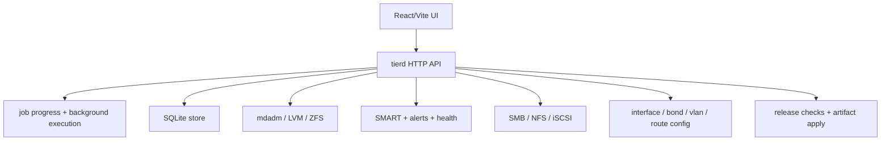
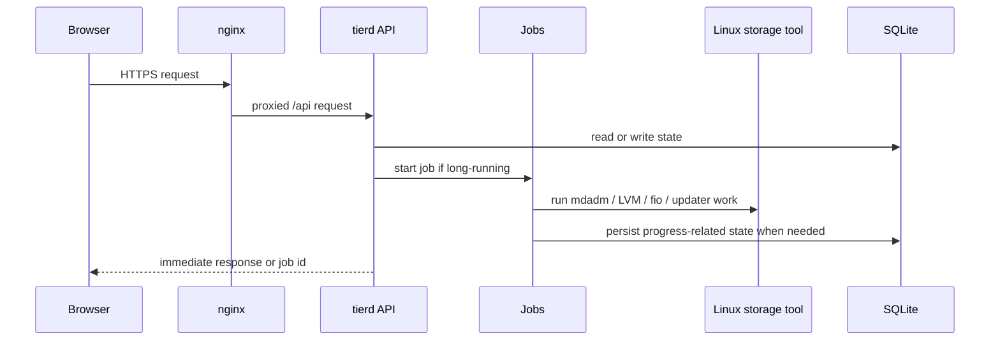
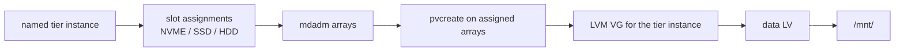

# SmoothNAS Source Deep Dive

This document explains how SmoothNAS is actually built.

The root [README.md](../README.md) is for users deciding whether the project is worth running. This file is for engineers trying to understand:

- how requests move through the system
- where state lives
- how storage orchestration is layered
- what is stable today
- what still needs cleanup after the recent repository migration

## Source Map

| Path | Role |
| --- | --- |
| [`/tierd`](../tierd) | Go backend service, API handlers, storage orchestration, monitoring, updater |
| [`/tierd/cmd`](../tierd/cmd) | `tierd` daemon and `tierd-cli` operator CLI (smoothfs / iSCSI / plugin / profile subcommands) |
| [`/tierd-ui`](../tierd-ui) | React/Vite UI (English + Dutch via i18n) |
| [`/runtime`](../runtime) | `smoothnas-runtime` plugin container runtime (LXC2Docker, Docker-compatible socket) |
| [`/iso`](../iso) | custom Debian installer and first-boot scripts |
| [`/scripts`](../scripts) | build, release-gate, and protocol-soak helpers |
| [`/docs`](../docs) | design history, architecture, operations, `aimee`, and proposals |
| [`/tierd/deploy`](../tierd/deploy) | nginx and systemd deployment assets |

## High-Level Shape

```mermaid
flowchart TD
    UI["React/Vite UI"] --> API["tierd HTTP API"]
    API --> Jobs["job progress + background execution"]
    API --> DB["SQLite store"]
    API --> Storage["mdadm / LVM / ZFS"]
    API --> Monitor["SMART + alerts + health"]
    API --> Sharing["SMB / NFS / iSCSI"]
    API --> Network["interface / bond / vlan / route config"]
    API --> Updater["release checks + artifact apply"]
```

The guiding pattern is simple:

- keep orchestration in Go
- keep durable state in SQLite
- call proven Linux tools rather than reimplementing them
- expose long-running work through async jobs so the UI does not hang

## Request Path

At runtime, the browser talks to nginx, and nginx proxies `/api/*` to the backend on localhost.

```mermaid
sequenceDiagram
    participant U as Browser
    participant N as nginx
    participant A as tierd API
    participant J as Jobs
    participant S as Linux storage tool
    participant D as SQLite

    U->>N: HTTPS request
    N->>A: proxied /api request
    A->>D: read or write state
    A->>J: start job if long-running
    J->>S: run mdadm / LVM / fio / updater work
    J->>D: persist progress-related state when needed
    A-->>U: immediate response or job id
```

The router is assembled in [`tierd/internal/api/router.go`](../tierd/internal/api/router.go). It wires together:

- auth
- disks and SMART
- arrays and tiers
- ZFS
- sharing
- networking
- benchmarking
- jobs
- system and updater endpoints
- terminal websocket access

## Backend Package Layout

### API layer

The `tierd/internal/api` package is the backend shell presented to the UI.

Major handlers:

- `arrays.go`: mdadm array CRUD, async jobs, rich array listing
- `tiers.go` / `tiering.go`: named tier instances, array-slot assignment, and the unified tiering control plane
- `sharing.go`: SMB, NFS, and iSCSI configuration APIs
- `backup.go`: backup job definitions, async runs, progress, and cancel
- `plugins.go`: plugin install, lifecycle, profiles, and the embed proxy
- `spindown.go`: disk power-management policy
- `system.go`: update channels, update checks, uploads, alerts, hardware, reboot/shutdown
- `network.go`: interface, bond, VLAN, DNS, route management
- `benchmark.go`: async fio-based benchmark execution

### State layer

The `tierd/internal/db` package stores durable appliance state in SQLite:

- auth sessions
- SMART history and alarms
- storage and sharing metadata
- named tier instances and slot assignments
- backup and plugin records

Important files:

- [`tier_instances.go`](../tierd/internal/db/tier_instances.go)
- [`migrations.go`](../tierd/internal/db/migrations.go)

SQLite is treated as a reconstructable cache for pool/tier topology. The
source of truth for that topology is on-disk tier metadata: `devmeta`
writes a JSON envelope on the fastest tier, and `tiermeta` writes a binary
envelope at the start of each per-tier metadata LV.

### Storage orchestration

Storage behavior is split across focused packages:

| Package | Role |
| --- | --- |
| `disk` | block-device discovery via `lsblk` |
| `mdadm` | RAID creation, disk prep, scrub, membership changes, stripe-cache tuning |
| `nonraid` | non-striped single/dual-parity ("unRAID-style") arrays, wrapping [`RakuenSoftware/nonraid`](https://github.com/RakuenSoftware/nonraid) |
| `fsarray` | first-class btrfs and bcachefs arrays built from raw disks |
| `lvm` | PV/VG/LV helpers, filesystems, and mounts for named tiers |
| `zfs` | pools, datasets, zvols, snapshots |
| `tier` | named tier provisioning and teardown |
| `tiering` | unified tiering control plane with per-backend adapters (mdadm / ZFS-raw / ZFS-managed) and activity bands |
| `tiermeta` / `devmeta` | persisted tier/pool topology metadata |

### Sharing, network, and observability

| Package | Role |
| --- | --- |
| `smb` / `nfs` / `iscsi` | share/export/LUN generation and service control |
| `firewall` | regenerates the full nftables ruleset for sharing ports on every change |
| `network` | interface, bond, VLAN, DNS, and route configuration |
| `nettest` | iperf3-based network throughput tests |
| `benchmark` | fio-driven storage benchmarks |
| `smart` | `smartctl` access and parsing |
| `monitor` | background polling for storage health, SMART history, alarm rules, and active alerts |
| `health` | structured health checks surfaced to the UI |
| `spindown` | idle-disk detection and spin-down power management |
| `iopressure` | Linux PSI (`/proc/pressure/io`) sampling |

### Apps, backup, and system

| Package | Role |
| --- | --- |
| `backup` | NFS/SMB backup runs via `cp`+sha256 verification or rsync |
| `plugin` (+ `plugin/runtime`) | plugin manifests, install/lifecycle/scale, tier-bound volumes, nginx embed proxy, and the LXC2Docker runtime client |
| `gpu` | GPU hardware discovery (system hardware page and plugin passthrough) |
| `updater` | GitHub release checks and artifact apply |
| `tuning` | idempotent kernel/network parameter tuning at startup |
| `cache` | small TTL value-cache utility |
| `integration` | end-to-end tests against a real `tierd` (root-only) |

### Background control loops

- `monitor`: SMART polling and alert generation
- per-adapter schedulers and planner loops for placement/movement work
- the plugin reconciler, which converges container state with declared manifests
- async job runner model in the API layer for destructive or slow operations

One-shot host remediation and tuning now sit outside the long-lived daemon:

- `tierd-host-init` systemd unit: orphaned backup mount cleanup, package healing, mdadm stripe-cache repair, and host tuning before `tierd` starts
- `tierd`: long-lived API, monitoring, reconciliation, schedulers, and smoothfs control-plane work
- `smoothnas-runtime`: separate systemd service exposing the LXC2Docker Docker-compatible socket for plugins

## Current Storage Model

The user-facing storage model is the named-tier-instance system exposed through `/api/tiers`.

Example:

- tier instance: `media`
- slot assignments:
  - `NVME -> /dev/md0`
  - `SSD -> /dev/md1`
  - `HDD -> /dev/md2`
- resulting mountpoint: `/mnt/media`

The relevant state lives in [`tierd/internal/db/tier_instances.go`](../tierd/internal/db/tier_instances.go).

The API flow for this model is implemented in [`tierd/internal/api/tiers.go`](../tierd/internal/api/tiers.go).

### Tier-instance provisioning flow

```mermaid
flowchart LR
    Tier["named tier instance"] --> Slots["slot assignments\nNVME / SSD / HDD"]
    Slots --> Arrays["mdadm arrays"]
    Arrays --> PV["pvcreate on assigned arrays"]
    PV --> VG["LVM VG for the tier instance"]
    VG --> LV["data LV"]
    LV --> Mount["/mnt/<tier-name>"]
```

### Why this matters

This is the model the UI and public API present today. Documentation for operators should lead with this model, not the older fixed-tier design language.

## Repository Migration Follow-Up That Still Needs Fixing

The repository has been migrated to `RakuenSoftware/smoothnas`, and the public updater channels now pull from that repo. The remaining migration debt is narrower and should stay explicit.

Current examples include:

- the Go module path in [`tierd/go.mod`](../tierd/go.mod) still uses `github.com/JBailes/SmoothNAS/tierd`
- the private `jbailes` update channel still clones `JBailes/SmoothNAS` over SSH and builds from source on-box

### Why this matters

- downstream imports and internal package identity should eventually match the new canonical repository
- the private update path should eventually consume authenticated release artifacts instead of recompiling on the appliance
- build, release, and update docs should stay honest about which repo is canonical and which path is temporary

This should be treated as planned cleanup work, not as invisible technical debt.

## smoothfs Extraction Follow-Up

`smoothfs` now lives in `RakuenSoftware/smoothfs` as its own project.
SmoothNAS consumes it as the appliance integrator:

- Go/runtime integration imports `github.com/RakuenSoftware/smoothfs/...`
- ISO bootstrap fetches a pinned SmoothFS repo ref for DKMS/VFS installation
- appliance API/UI and operator flows remain in this repo

The staged extraction plan is preserved as historical context in
[../docs/proposals/done/smoothfs-repo-split.md](../docs/proposals/done/smoothfs-repo-split.md).

## Storage Subsystems

### mdadm arrays

Managed in [`tierd/internal/mdadm`](../tierd/internal/mdadm).

Responsibilities:

- disk preparation before assembly
- asynchronous array creation
- scrub operations
- member add/remove/replace flows
- parity tuning such as `stripe_cache_size`

### LVM and named tier provisioning

Managed in:

- [`tierd/internal/lvm`](../tierd/internal/lvm)
- [`tierd/internal/tier`](../tierd/internal/tier)

Capabilities already present in the tree:

- PV/VG/LV primitives
- per-tier VG creation
- per-tier `data` LV provisioning
- filesystem creation and mount management

The implementation depth here is greater than the current user docs suggest, which is why the architecture pages exist.

### ZFS

Managed separately in [`tierd/internal/zfs`](../tierd/internal/zfs).

That separation is intentional. SmoothNAS is not trying to force one storage substrate onto every workload.

### Other array shapes

Two further array models live alongside mdadm:

- [`tierd/internal/nonraid`](../tierd/internal/nonraid): non-striped single/dual-parity arrays in the unRAID tradition, wrapping the [`RakuenSoftware/nonraid`](https://github.com/RakuenSoftware/nonraid) module. Useful when independent-disk recovery matters more than striped throughput.
- [`tierd/internal/fsarray`](../tierd/internal/fsarray): first-class btrfs and bcachefs arrays built directly from raw disks.

### Unified tiering control plane

[`tierd/internal/tiering`](../tierd/internal/tiering) is the convergence layer for the tier model. It exposes a backend-agnostic control plane with per-backend adapters (mdadm, ZFS-raw, ZFS-managed) registered at startup via `tieringHandler.RegisterAdapter`. Each adapter derives its own "activity band" values; the control plane deliberately never compares band derivations across adapters.

This is the surface the named-tier UI and the smoothfs planner sit on top of, and it is the long-term home for the tier behavior that the older `tier` package still partly implements.

## Plugins and the App Runtime

SmoothNAS runs co-located workloads as managed containers rather than hand-rolled host services. The implementation spans:

- [`tierd/internal/plugin`](../tierd/internal/plugin): manifest schema and parsing, install/lifecycle/scale, tier-bound and flat volume resolution, the nginx embed proxy, and a reconciler that converges container state with declared manifests
- [`tierd/internal/plugin/runtime`](../tierd/internal/plugin/runtime): the client for the runtime daemon
- [`/runtime`](../runtime): `smoothnas-runtime`, a systemd service that exposes the [LXC2Docker](https://github.com/games-on-whales/LXC2Docker) Docker-compatible API on `/run/smoothnas-runtime/docker.sock`

Plugins are LXC system containers spoken to over the Docker Engine API. tierd treats LXC2Docker the same way it treats `mdadm` or `nginx` — an external binary with a stable interface. Operators never reach around tierd to the runtime directly.

Two artifact shapes resolve to the same managed-container model: published OCI images, and distro templates with an optional package + setup overlay. Plugin volumes bind to a named tier — never to a specific slot/array; the data rides the tier's smoothfs mount and is placed across its arrays by the tiering engine like any other file. Ports are reverse-proxied through nginx to the container's bridge IP (no host port publishing by default), and uninstall is all-or-none — container, image cache, network, firewall holes, and volumes go together.

The design history and phase breakdown live in [../docs/proposals/pending/smoothnas-plugins.md](../docs/proposals/pending/smoothnas-plugins.md).

## Backup

[`tierd/internal/backup`](../tierd/internal/backup) implements backup runs over `cp`+sha256 verification or rsync, with the API surface in [`tierd/internal/api/backup.go`](../tierd/internal/api/backup.go).

Behavior worth knowing before editing:

- runs are async jobs with live progress, throughput, cancel, and terminal state
- a backup refuses a local target that resolves to the root filesystem, so an absent mount cannot fill the OS disk
- when the target resolves to a mounted smoothfs pool, bulk-ingest routing applies

## Frontend Structure

The frontend app lives in [`tierd-ui/src`](../tierd-ui/src), with the route tree rooted in [`tierd-ui/src/App.tsx`](../tierd-ui/src/App.tsx) and the browser bootstrap in [`tierd-ui/src/main.tsx`](../tierd-ui/src/main.tsx).

The UI is organized around operational domains:

- dashboard
- disks and SMART
- arrays
- tiers and tiering inventory
- pools and ZFS objects
- sharing
- backups
- plugins (install, detail, and embedded plugin UI)
- benchmarks
- network
- users
- settings
- terminal

The frontend uses the backend job model heavily. Long-running tasks are started, handed a `job_id`, and then polled until completion so the UI stays responsive.

Localization is handled through an `I18nProvider` with English and Dutch locale bundles under [`tierd-ui/src/i18n/locales`](../tierd-ui/src/i18n/locales); the active language follows the logged-in user's saved preference.

## Agent Workflow

The repo exposes `aimee` as a local MCP server for engineering agents. If you are entering the codebase through an agent workflow, read [../docs/AIMEE.md](../docs/AIMEE.md) before diving into subsystem code.

## Installer and Deployment

The appliance install story is not an afterthought. The `/iso` directory contains a custom Debian installer flow that:

- boots into a guided shell-based environment
- provisions the OS separately from managed storage
- installs required packages
- deploys the backend and frontend
- configures nginx and system services

Read:

- [`iso/build-iso.sh`](../iso/build-iso.sh) and [`iso/hooks/`](../iso/hooks)
- [docs/OPERATIONS.md](../docs/OPERATIONS.md)

## Recommended Reading Order

If you are new to the codebase:

1. [README.md](../README.md)
2. [docs/ARCHITECTURE.md](../docs/ARCHITECTURE.md)
3. [docs/AIMEE.md](../docs/AIMEE.md) if you are using an agent client
4. [`tierd/internal/api/router.go`](../tierd/internal/api/router.go)
5. [`tierd/internal/api/tiers.go`](../tierd/internal/api/tiers.go)
6. [`tierd/internal/api/arrays.go`](../tierd/internal/api/arrays.go)
7. [`tierd/internal/db/tier_instances.go`](../tierd/internal/db/tier_instances.go)
8. [`tierd/internal/tier`](../tierd/internal/tier) and [`tierd/internal/tiering`](../tierd/internal/tiering)
9. [`tierd/internal/plugin`](../tierd/internal/plugin) if you are working on the app runtime

That path gets you from product shape to request flow to storage implementation with the least context switching.
